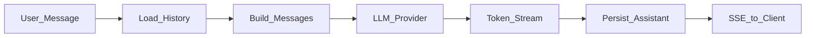
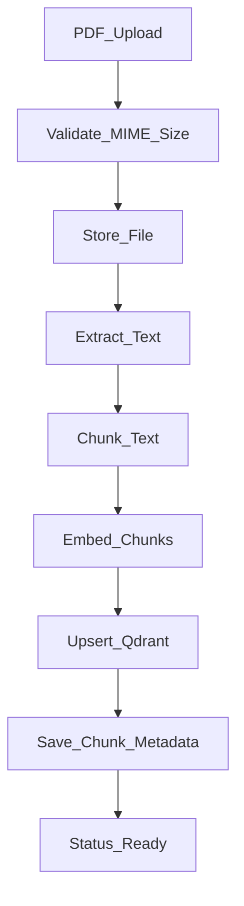
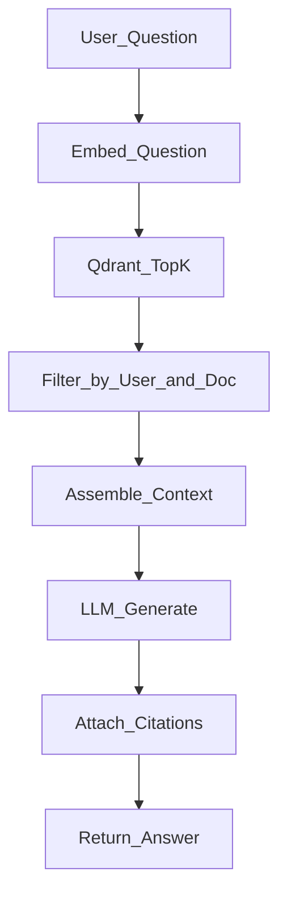

# AI Workflows

## Chat completion (V1)

- System prompt: concise assistant for workspace chat.
- History window: last N messages (config) to control context size.
- Usage event optional after completion.

## PDF RAG ingest (V1)

**Chunking defaults (tunable):** ~500–800 tokens, ~10–15% overlap; retain `page_number` when extractors provide it.

## PDF RAG query (V1)

**Grounding rule:** Prompt instructs the model to answer only from provided snippets; if insufficient, say so.

## Out of scope until later

| Workflow | Version |
|----------|---------|
| Hybrid BM25 + vector + rerank | V1.x+ |
| OCR pipeline | later |
| SQL agent tool loop | V2 |
| Multi-agent LangGraph planner | V6 |

## Evaluation (lightweight V1)

- Manual fixture PDF with known facts
- Assert citation document IDs present
- Spot-check refusal when question is off-document
