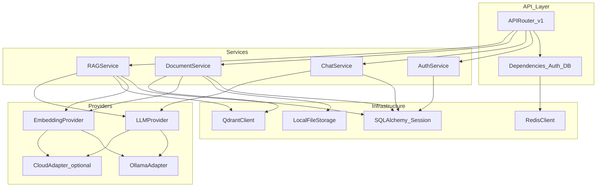
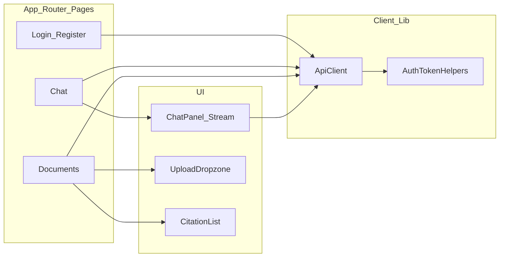

# Component Diagram

## Backend components (V1)

## Frontend components (V1)

## Trust boundaries

- Browser never talks to PostgreSQL, Qdrant, or Ollama directly.
- All AI and file processing goes through the API.
- Document and chat queries are scoped by authenticated `user_id`.
