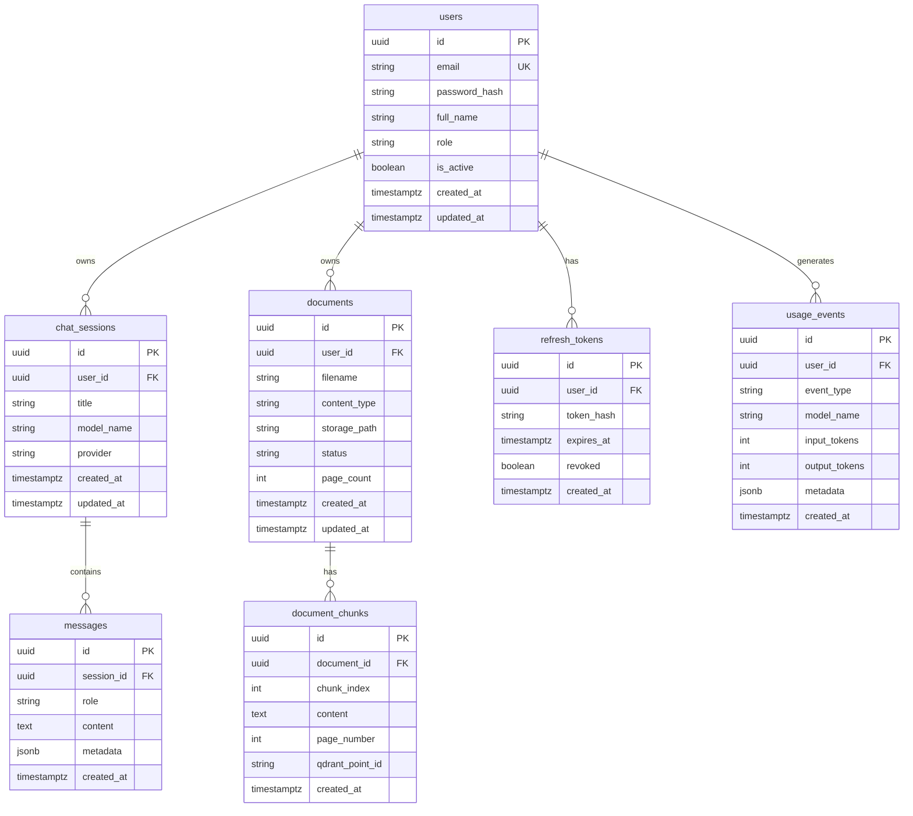

# Data Model (ER)

## Entity Relationship (V1)

## Notes

- **Passwords:** Store only hashes (bcrypt/argon2); never plaintext.
- **Refresh tokens:** Store hash of token; support revoke on logout.
- **Document status:** `pending | processing | ready | failed`.
- **Qdrant payload:** `user_id`, `document_id`, `chunk_id`, `page_number`, optional `filename` for filtered search.
- **Messages.metadata:** Citations, model info, token counts, RAG flags.
- **usage_events:** Lightweight metering for dashboard (V6); optional writes in V1 chat/RAG paths.

## Indexes (planned)

- `users.email` unique
- `chat_sessions(user_id, updated_at DESC)`
- `messages(session_id, created_at)`
- `documents(user_id, created_at DESC)`
- `document_chunks(document_id, chunk_index)`
- `refresh_tokens(user_id)`, `refresh_tokens(token_hash)` unique
