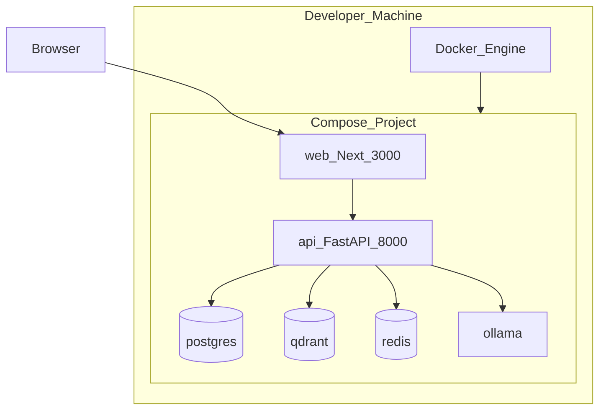

# Deployment Diagram

## Local development (Phase 2+)



## Target production shape (Compose + Nginx)

```bash
docker compose -f docker-compose.yml -f docker-compose.prod.yml --profile apps up -d --build
```

Nginx terminates HTTP on `:80`, proxies `/api` → API and `/` → Next.js. See [`deploy/nginx/nginx.conf`](../../deploy/nginx/nginx.conf).

## Environment configuration

| Variable group | Examples |
|----------------|----------|
| App | `ENVIRONMENT`, `LOG_LEVEL`, `API_PREFIX` |
| Security | `JWT_SECRET`, `ACCESS_TOKEN_TTL`, `REFRESH_TOKEN_TTL`, `CORS_ORIGINS` |
| Database | `DATABASE_URL` |
| Qdrant | `QDRANT_URL`, `QDRANT_COLLECTION` |
| Redis | `REDIS_URL` |
| AI | `LLM_PROVIDER`, `OLLAMA_BASE_URL`, `OLLAMA_CHAT_MODEL`, `OLLAMA_EMBED_MODEL`, optional cloud keys |
| Storage | `UPLOAD_DIR`, `MAX_UPLOAD_MB` |

See repository root `.env.example` once scaffolded.

## CI (from Phase 2)

- Lint/typecheck web and API on PR
- Run unit tests when present
- No production deploy until Phase 15
