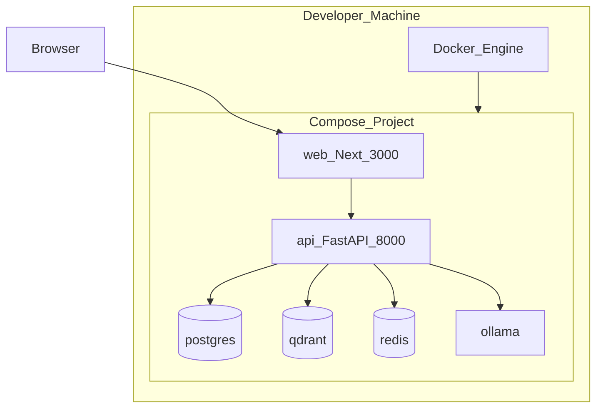

# Deployment Diagram

## Local development (Phase 2+)



## Target production shape (Compose + Nginx)

```bash
docker compose -f docker-compose.yml -f docker-compose.prod.yml --profile apps up -d --build
```

Nginx terminates HTTP on `:80`, proxies `/api` → API and `/` → Next.js. See [`deploy/nginx/nginx.conf`](../../deploy/nginx/nginx.conf).

## Public cloud (portfolio demo)

See [`docs/DEPLOY_CLOUD.md`](../DEPLOY_CLOUD.md):

- **Web:** Vercel (`apps/web`, `vercel.json`)
- **API + Postgres:** Render Blueprint (`render.yaml`) or Railway (`railway.toml`)
- **LLM:** OpenAI/Mistral (Ollama is local-only)

## Environment configuration

| Variable group | Examples |
|----------------|----------|
| App | `ENVIRONMENT`, `LOG_LEVEL`, `API_PREFIX` |
| Security | `JWT_SECRET`, `CORS_ORIGINS`, `CORS_ORIGIN_REGEX` |
| Database | `DATABASE_URL` |
| Qdrant | `QDRANT_URL`, `QDRANT_COLLECTION` |
| Redis | `REDIS_URL` |
| AI | `LLM_PROVIDER`, `OLLAMA_*`, optional cloud keys |
| Storage | `UPLOAD_DIR`, `MAX_UPLOAD_MB` |

See repository root `.env.example`.

## CI

- Lint/format/test API (Ruff pinned) and web (typecheck + build) on push/PR
- Actions: `checkout@v5`, `setup-python@v6`, `setup-node@v6`
