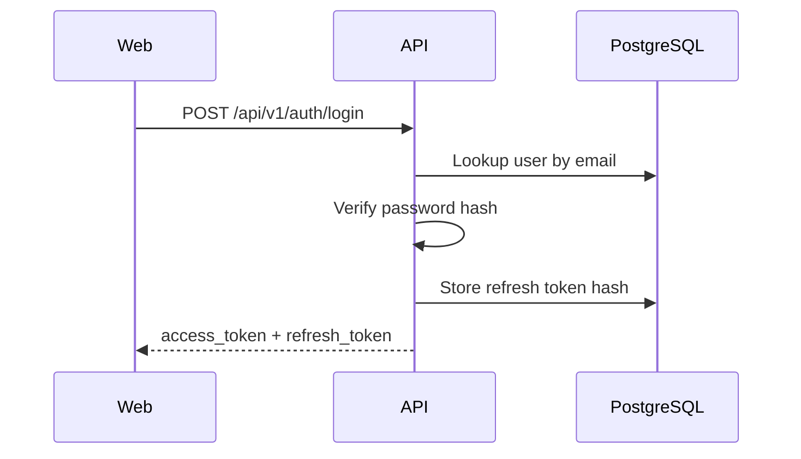
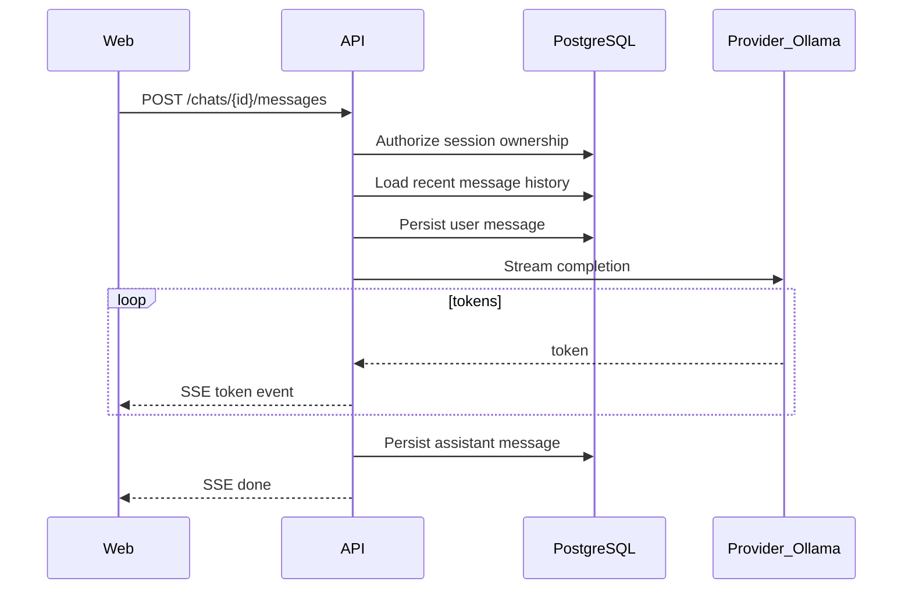
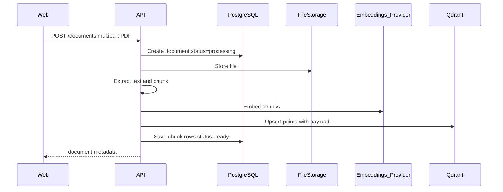
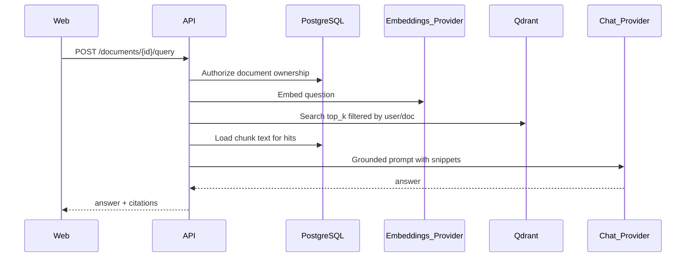
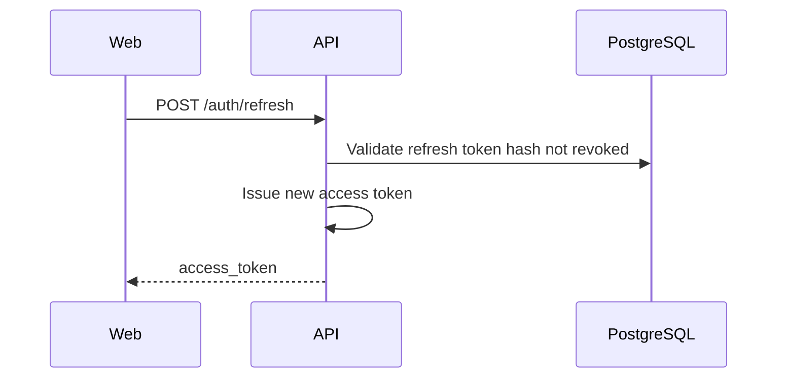

# Sequence Diagrams

## Login

```mermaid
sequenceDiagram
  participant Web
  participant API
  participant DB as PostgreSQL

  Web->>API: POST /api/v1/auth/login
  API->>DB: Lookup user by email
  API->>API: Verify password hash
  API->>DB: Store refresh token hash
  API-->>Web: access_token + refresh_token
```

## Chat streaming

```mermaid
sequenceDiagram
  participant Web
  participant API
  participant DB as PostgreSQL
  participant LLM as Provider_Ollama

  Web->>API: POST /chats/{id}/messages
  API->>DB: Authorize session ownership
  API->>DB: Load recent message history
  API->>DB: Persist user message
  API->>LLM: Stream completion
  loop tokens
    LLM-->>API: token
    API-->>Web: SSE token event
  end
  API->>DB: Persist assistant message
  API-->>Web: SSE done
```

## RAG ingest

```mermaid
sequenceDiagram
  participant Web
  participant API
  participant DB as PostgreSQL
  participant FS as FileStorage
  participant Emb as Embeddings_Provider
  participant QD as Qdrant

  Web->>API: POST /documents multipart PDF
  API->>DB: Create document status=processing
  API->>FS: Store file
  API->>API: Extract text and chunk
  API->>Emb: Embed chunks
  API->>QD: Upsert points with payload
  API->>DB: Save chunk rows status=ready
  API-->>Web: document metadata
```

## RAG query

```mermaid
sequenceDiagram
  participant Web
  participant API
  participant DB as PostgreSQL
  participant Emb as Embeddings_Provider
  participant QD as Qdrant
  participant LLM as Chat_Provider

  Web->>API: POST /documents/{id}/query
  API->>DB: Authorize document ownership
  API->>Emb: Embed question
  API->>QD: Search top_k filtered by user/doc
  API->>DB: Load chunk text for hits
  API->>LLM: Grounded prompt with snippets
  LLM-->>API: answer
  API-->>Web: answer + citations
```

## Token refresh

```mermaid
sequenceDiagram
  participant Web
  participant API
  participant DB as PostgreSQL

  Web->>API: POST /auth/refresh
  API->>DB: Validate refresh token hash not revoked
  API->>API: Issue new access token
  API-->>Web: access_token
```
